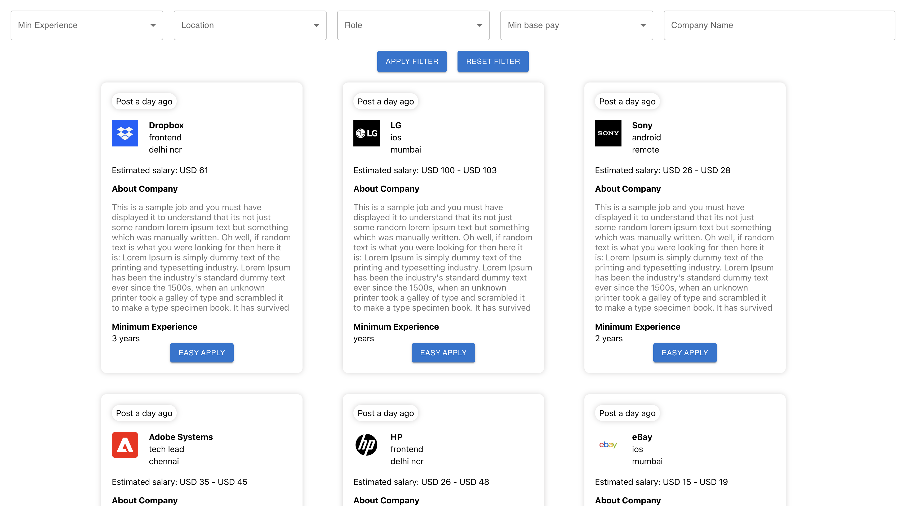
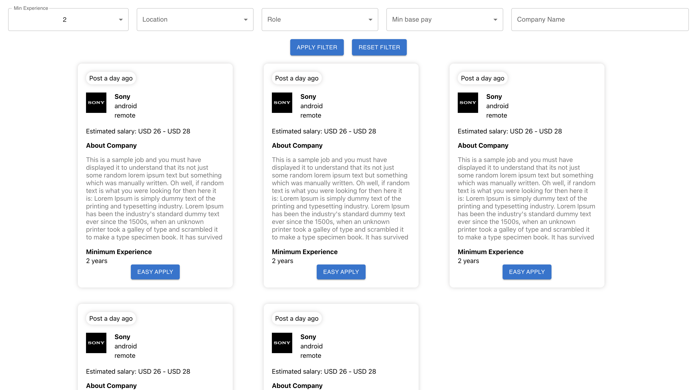
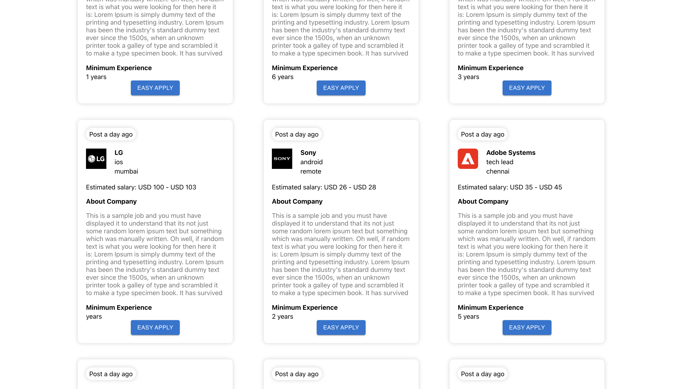

## React
npm start for run the app

## Redux
used for manage the state

screenshots:

filter applied

infinite scroll

## NOTE:
I haven't included page details in the API call to fetch the next set of data because it wasn't defined in the documentation. As a result, each time we scroll to the bottom, I fetch the same data again using the API call. I hope this clarifies the situation.